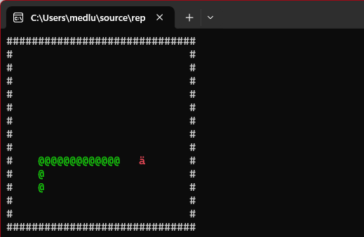
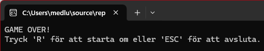

# Snake i C#

Jag har gjort en väldigt enkel version av Snake som körs i konsolen.  

Man styr med piltangenterna och ormen växer när man äter äpplen (markerade som `ä`). Om man kör in i väggen eller in i sig själv så är det Game Over.  

Efter Game Over kan man trycka `R` för att spela igen eller `ESC` för att avsluta.  

---

### Några bilder  

**Spelet igång:**  

**Game Over:** 

---
